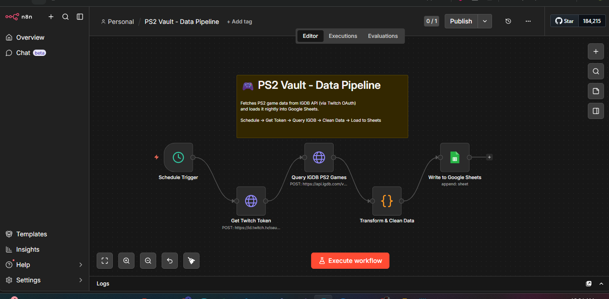

# 🎮 PS2 Vault – Game Analytics Dashboard

## 📌 Overview
PS2 Vault is a themed data analytics project built around PlayStation 2 game data.  
The goal was to create an end-to-end portfolio project that combines API extraction, workflow automation, cloud spreadsheet storage, and Power BI visualization in a single pipeline.

This project uses the IGDB API to collect PS2 game metadata, processes the data through n8n, stores it in Google Sheets, and visualizes it in a custom Power BI dashboard inspired by the PlayStation 2 aesthetic.

---

## 🎯 Objectives
- 🔌 Build an automated ETL-style workflow using real API data
- ☁️ Store and refresh game data in a lightweight cloud-based repository
- 📊 Design an interactive Power BI dashboard for exploration and storytelling
- 🏆 Create a portfolio project that is more memorable than traditional sales or finance dashboards

---

## 🛠️ Tech Stack

| Layer | Tool |
|---|---|
| 🎮 Data Source | IGDB API / Twitch OAuth |
| ⚙️ Automation | n8n (self-hosted) |
| 🗄️ Storage | Google Sheets |
| 📊 Visualization | Power BI |
| 🌐 Planned Front-End | Three.js interactive PS2 bedroom experience |

---

## 🔄 Data Pipeline

The project follows this flow:

```
🎮 IGDB API → ⚙️ n8n workflow → 📋 Google Sheets → 📊 Power BI dashboard
```

### ⚡ Workflow Steps
1. 🔐 Authenticate with Twitch OAuth to access the IGDB API
2. 📡 Query PS2 game data from IGDB
3. 🔧 Transform and clean the response inside n8n
4. 📤 Load the data into Google Sheets
5. 🔗 Connect Power BI to the sheet for dashboard reporting

---

## 🗃️ Dataset

The dataset includes PlayStation 2 game information such as:

- 🏷️ Game name
- ⭐ Aggregated rating
- 🔢 Rating count
- 🎭 Genre
- 📅 Release date
- 🏢 Developer
- 👥 Multiplayer flag
- 🖼️ Cover URL
- 📝 Summary

---

## 📊 Dashboard Features

- 🔢 **Total Games** KPI
- ⭐ **Average Rating** KPI
- 🎙️ **Average Critic Count** KPI
- 🏆 **Top 10 Games by Rating**
- 👥 **Multiplayer Breakdown**
- 🎭 **Genre Distribution**
- 📅 **Games Released Per Year**
- 🔍 **Genre slicer for filtering**

---

## 🎨 Design Direction

The dashboard was styled with a PlayStation-inspired visual theme using:

- 🌑 Dark navy background
- ⚡ Electric blue accent color
- 🎮 PlayStation logo branding
- 🕹️ Retro gaming visual tone

The goal was to create a dashboard that feels consistent with the PS2 identity while still remaining readable and professional.

---

## 💡 Key Insights

Some quick insights from the current dataset:

- 🎮 The dataset contains **47 PS2 games**
- ⭐ The average rating is **72.74**
- 🎙️ The average critic count is **6.98**
- 📅 PS2 releases in this sample appear concentrated around the mid-to-late 2000s
- 👥 Multiplayer-enabled games represent a smaller share of the dataset than single-player titles

---

## 🖼️ Screenshot


## ⚙️ N8N Pipeline

---

## 📚 What I Learned

Through this project, I practiced:

- 🔐 API authentication and data extraction
- ⚙️ Workflow automation with n8n
- 🔧 Transforming semi-structured JSON data
- 📊 Building a clean BI dashboard in Power BI
- 🎨 Applying thematic dashboard design to improve storytelling

---

## 🚀 Future Improvements

- ➕ Add more PS2 titles and metadata fields
- 🔧 Improve genre normalization and categorization
- 🌐 Build the planned Three.js interactive bedroom interface
- 🔗 Connect the front-end directly to the live Google Sheets data
- 🔍 Add deeper analysis such as top developers, rating trends, and multiplayer patterns

---

## 👤 Author

**Ahmed Ahaïk**
